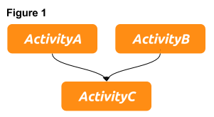

[](https://travis-ci.com/babbel/floto)

# floto
floto is a task orchestration tool based on AWS SWF (Simple Workflow Service) written in Python. It uses Python 3 and boto3, the AWS SDK for Python.

<!-- START doctoc generated TOC please keep comment here to allow auto update -->
<!-- DON'T EDIT THIS SECTION, INSTEAD RE-RUN doctoc TO UPDATE -->
**Table of Contents**

- [Introduction](#introduction)
- [Defining the Workflow's Logics](#defining-the-workflows-logics)
  - [Tasks](#tasks)
    - [Activity Task](#activity-task)
    - [Generator](#generator)
    - [ChildWorkflow](#childworkflow)
    - [Timer](#timer)
    - [Retry Strategy](#retry-strategy)
- [Decider](#decider)
  - [Dynamic Decider](#dynamic-decider)
  - [Decider Daemon](#decider-daemon)
  - [JSON Representation of Decider Specifications](#json-representation-of-decider-specifications)
- [Activities](#activities)
  - [Activity](#activity)
  - [Generator](#generator-1)
  - [Activity Context](#activity-context)
  - [Activity Result](#activity-result)
- [Activity Worker](#activity-worker)
  - [Activity Worker Heartbeats](#activity-worker-heartbeats)
- [floto's simple SWF API](#flotos-simple-swf-api)
  - [Interface to SWF](#interface-to-swf)
  - [Start the Workflow](#start-the-workflow)
  - [Register Domains, Workflow Type and Activity Type](#register-domains-workflow-type-and-activity-type)

<!-- END doctoc generated TOC please keep comment here to allow auto update -->
## Introduction
The <a href="https://aws.amazon.com/swf/" target="_blank">AWS Simple Workflow Service</a> allows to 
manage distributed applications in a scalable, resilient and fault tolerant way.
It minimizes the complexity by decoupling the execution logic from the application worker. The 
Deciders, which handle the execution logic and the worker are stateless and therefore fault 
tolerant. Whenever something goes wrong the Deciders and worker can be restarted and pick up their 
work where they left off. Furthermore several Deciders and worker of the same kind can be run at 
the same time without interference of the workflow execution or result which again leads to 
higher resilience and scalability. Every step of a workflow execution is recorded by SWF and the 
history of events is provided to the Deciders when they are about to schedule tasks.

The process of implementing a SWF workflow can be somewhat tedious if you want to e.g. 
handle complex execution logic and treat task failures and time-outs.
floto solves this problem by providing a Python package which allows you to easily define the 
execution logic and activity worker.
For the impatient we provide a ["Getting started example"](examples/hello_world.py) of a
simple workflow.
The example shows the definition of a simple workflow with a single task. The task is defined and passed to the Decider. Furthermore an activity is defined so that the worker is able to executes the activity function on request. The Decider and the worker are started and the workflow execution is initiated. The single steps to define the components necessary to execute a workflow are discussed in more detail in the next sections.

## Defining the Workflow's Logics
The business logic of your distributed application is handled by so called Deciders. Deciders act on events like workflow start, task completion or task failure and schedule tasks that are to be executed. The logic itself is defined by a list of tasks. The tasks are then [passed to the decider](#decider).
Let's get started with a simple example of three activities as depicted in figure 1.  In this example ``ActivityA`` and ``ActivityB`` are scheduled after the workflow start. ``ActivityC`` is executed once they are completed.



The definition of the activity tasks:
```python
from floto.specs.task import ActivityTask

activity_task_a = ActivityTask(name='ActivityA', version='v1')
activity_task_b = ActivityTask(name='ActivityB', version='v1')
activity_task_c = ActivityTask(name='ActivityC', version='v1', requires=[activity_task_a, activity_task_b])
```
floto provides different kinds of tasks which can be used to define the workflow logic. In the aforementioned example objects of type ``ActivityTask`` have been used. Furthermore there are Timer, ChildWorkflow and Generator tasks which are described in the following sections.
### Tasks
The tasks are the building blocks of the execution logic. All tasks implement the ``floto.specs.task.Task`` interface, which has the fields ``id_`` and ``requires``. The id of task must be unique on the workflow level. For ``Timer`` objects it has to be set explicitly. For the other tasks there is a default value which is derived by the object's properties, however it can be set explicitly. This is described in the corresponding sections. Dependencies of the tasks are defined by a list of required tasks. 
#### Activity Task
Activity tasks are tasks which trigger the execution of activity function by the Decider. ``ActivityTask`` objects have the following properties:

| Parameter | Type | Description |
| :---         | :---           | :---          |
| ``name`` [Required]   | ``str``        | The name of the activity. Corresponds to the name of the activity as defined by the [worker](#activity-worker).   |
| ``version`` [Required]   | ``str``        | The version of the activity. Corresponds to the version of the activity as defined by the [worker](#activity-worker).    |
| ``activity_id``   | ``str``        | The unique id of the task. Defaults to ``<name:version:hash_id>``. The ``hash_id`` is derived depending on the input and required tasks.    |
| ``requires``   | ``list``        | List of ``floto.specs.task.Task`` objects, which defines the dependencies.    |
| ``input``   | ``str``, ``obj``        | The input provided by the task definition. If an object is provided it must be JSON serializable, e.g. of type dict or list. For more information on inputs see section [Activity Context](#activity-context).    |
| ``retry_strategy``   | ``floto.specs.retry_strategy.Strategy``        | The retry strategy which defines the behavior in case of task failure. See section [Retry Strategy](#retry-strategy)    |
| ``task_list``   | ``str``        | The task list which is used when the task is scheduled. If not set the default activity task list of the decider is used.    |

#### Generator
``floto.specs.task.Generator`` inherits from ``ActivityTask`` and implements the same interface. Generators are activities which spawn tasks that are subsequently included in the execution logic. More on generators in section [Generator](#generators). 
To see how generators work see the ``examples/s3_file_string_length`` example.
#### ChildWorkflow
Deciders can start child workflows during execution. See example ``examples/child_workflow``. The following table gives an overview over the child workflow task parameters:

| Parameter | Type | Description |
| :---         | :---           | :---          |
| ``workflow_type_name`` [Required]   | ``str``        | The name of the workflow type.   |
| ``workflow_type_version`` [Required]   | ``str``        | The version of the workflow type.    |
| ``workflow_id``   | ``str``        | The unique id of the task. Defaults to ``<workflow_type_name:workflow_type_version:hash_id>``. The ``hash_id`` is derived depending on the input and required tasks.    |
| ``requires``   | ``list``        | List of ``floto.specs.task.Task`` objects, which defines the dependencies.    |
| ``input``   | ``str``, ``obj``        | The input provided by the task definition. If an object is provided it must be JSON serializable, e.g. of type dict or list. For more information on inputs see section [Activity Context](#activity-context).    |
| ``retry_strategy``   | ``floto.specs.retry_strategy.Strategy``        | The retry strategy which defines the behavior in case of task failure. See section [Retry Strategy](#retry-strategy)    |
| ``task_list``   | ``str``        | The decider task list of the child workflow.    |

#### Timer
#### Retry Strategy
## Decider
### Dynamic Decider
### Decider Daemon
### JSON Representation of Decider Specifications
## Activities
### Activity
### Generator
### Activity Context
### Activity Result
## Activity Worker
### Activity Worker Heartbeats
## floto's simple SWF API
For easier access to the SWF API floto provides functionality throught the ``floto.api`` module.
### Interface to SWF
In order to communicate with SWF create an ``swf`` object:
```python
import floto.api
swf = floto.api.Swf()
```
### Start the Workflow
```python
swf.start_workflow_execution(domain='floto_test',    
                             workflow_type_name=workflow_type.name,    
                             workflow_type_version=workflow_type.version,    
                             task_list='decider_task_list',
                             input='your_input')
```

### Register Domains, Workflow Type and Activity Type
```python

# Register a domain
swf.domains.register_domain('floto_test')

# Define and register a workflow type.
workflow_type = floto.api.WorkflowType(domain='floto_test', name='my_workflow_type', version='v1')
swf.register_workflow_type(workflow_type)

# Define and register an activity type
activity_type = floto.api.ActivityType(domain='floto_test', name='simple_activity', version='v1')
swf.register_activity_type(activity_type)
```
